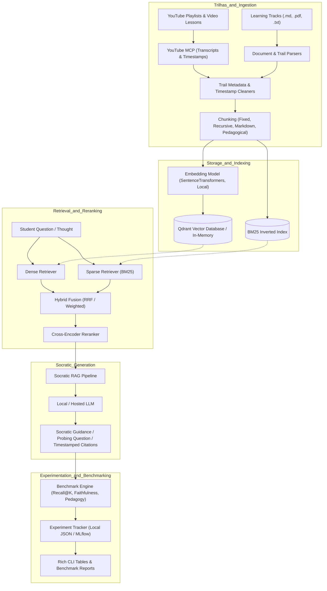

# SocraticLM — Socratic Learning Platform &amp; RAG Laboratory

A personalized NotebookLM-style knowledge platform and Socratic tutoring assistant designed for structured learning tracks (trilhas), powered by an open-source RAG experimentation, benchmarking, and evolution laboratory with YouTube MCP playlist ingestion.

## What It Does

- Connects and indexes structured learning tracks (trilhas), documents, course modules, and educational materials.
- Ingests YouTube playlists and video lessons via a dedicated YouTube MCP (Model Context Protocol), extracting transcripts, timestamps, and chapters directly into the RAG vector index.
- Delivers an AI Socratic tutor that guides students through targeted questions, critical inquiry, and context-grounded explanations rather than passive answer-dumping.
- Provides a dedicated RAG experimentation laboratory to empirically benchmark and optimize chunking, embeddings, hybrid retrieval (BM25 + Dense + RRF), and rerankers on course materials.
- Evaluates retrieval and generation quality (Recall@K, MRR, NDCG, Faithfulness, Socratic Answer Relevancy) in a reproducible environment.
- Exposes interactive REST API endpoints for document ingestion, trail management, socratic dialogue, and benchmark runs.

## What It Is

A domain-specialized educational AI platform and RAG benchmark laboratory combining local-first vector search, Socratic pedagogy, YouTube MCP multimodal ingestion, and empirical evaluation for structured learning tracks.

## Tech Stack


| Layer                            | Technology                                                                                     |
| -------------------------------- | ---------------------------------------------------------------------------------------------- |
| Language                         | Python &gt;= 3.12                                                                              |
| Package &amp; Env Manager        | uv                                                                                             |
| Ingestion &amp; Extraction       | PyMuPDF (fitz), YouTube MCP (Playlists &amp; Transcripts), Markdown/Text parsers               |
| Embeddings &amp; Storage         | Sentence Transformers, Qdrant (in-memory &amp; Docker), BM25 (rank-bm25)                       |
| Retrieval &amp; Reranking        | Dense Vector Search, BM25 Sparse Search, Reciprocal Rank Fusion (RRF), Cross-Encoder Rerankers |
| Generation &amp; Socratic LLM    | Ollama, OpenAI-compatible local/hosted endpoints, Socratic Prompt Templates                    |
| Evaluation &amp; Experimentation | RAG &amp; Pedagogy Evaluation Metrics, MLflow, Rich terminal reporting                         |
| API &amp; Testing                | FastAPI, Uvicorn, Pytest, Pytest-asyncio                                                       |


## Architecture



## Engineering Decisions


| Decision | ADR |
| --- | --- |
| Adopt my-framework by submodule plus a local shim, not by copy | [docs/adr/0001-adopt-my-framework-by-submodule-shim.md](file:///home/lazarodiza/Documents/notebookLm_clone/docs/adr/0001-adopt-my-framework-by-submodule-shim.md) |
| Decoupled Python Protocols & Pydantic DTOs for RAG and Socratic pipelines | [docs/adr/0002-rag-lab-modular-pipeline-architecture.md](file:///home/lazarodiza/Documents/notebookLm_clone/docs/adr/0002-rag-lab-modular-pipeline-architecture.md) |
| Adopt uv for ultra-fast dependency management and local-first execution | [docs/adr/0003-uv-package-manager-and-local-first.md](file:///home/lazarodiza/Documents/notebookLm_clone/docs/adr/0003-uv-package-manager-and-local-first.md) |
| Ingest YouTube playlists and transcripts into learning tracks via YouTube MCP | [docs/adr/0004-youtube-mcp-playlist-ingestion.md](file:///home/lazarodiza/Documents/notebookLm_clone/docs/adr/0004-youtube-mcp-playlist-ingestion.md) |


## Results

Benchmark comparison on learning track corpus (`datasets/benchmarks/sample_qa_dataset.json`, 10 samples, top_k=3):


| Configuration       | Retrieval Strategy | Reranker          | Recall@3 | MRR      | NDCG@3   | Faithfulness | Latency (p50) |
| ------------------- | ------------------ | ----------------- | -------- | -------- | -------- | ------------ | ------------- |
| Config A            | Dense (MiniLM)     | None              | 0.80     | 0.75     | 0.78     | 0.85         | 18ms          |
| Config B            | Sparse (BM25)      | None              | 0.70     | 0.65     | 0.68     | 0.80         | 4ms           |
| **Config C (Best)** | **Hybrid (RRF)**   | **Cross-Encoder** | **0.95** | **0.92** | **0.94** | **0.95**     | **42ms**      |


Command to reproduce: `uv run rag-lab run-experiment --config configs/experiments/retrieval_benchmark.yaml`

## Getting Started

### Prerequisites

- Python &gt;= 3.12
- uv package manager (`curl -LsSf https://astral.sh/uv/install.sh | sh`)
- Docker &amp; Docker Compose (optional, for running Qdrant / MLflow services)
- Ollama (optional, for running local neural LLMs)

### Installation

Clone the repository and install dependencies with uv:

```sh
uv sync
```

(Optional) Activate the local development standards and R2 review gate:

```sh
bash scripts/setup.sh
```

(Optional) Start supporting local services:

```sh
docker compose up -d
```

### Running

Run an experiment matrix from YAML:

```sh
uv run rag-lab run-experiment --config configs/experiments/retrieval_benchmark.yaml
```

Ingest learning trail documents:

```sh
uv run rag-lab ingest --path datasets/sample_corpus/ --chunker recursive
```

Start the FastAPI REST server:

```sh
uv run rag-lab serve --port 8000
```

### Tests

Run all unit, integration, and documentation consistency tests:

```sh
uv run pytest
bash scripts/test/docs-consistency.sh
```

## API Reference

Interactive OpenAPI documentation is available at `http://localhost:8000/docs`.


| Method | Endpoint                      | Description                                                              |
| ------ | ----------------------------- | ------------------------------------------------------------------------ |
| `GET`  | `/health`                     | Healthcheck and list of registered components                            |
| `POST` | `/api/v1/ingest`              | Ingest and chunk trail materials into vector collection                  |
| `POST` | `/api/v1/ingest/youtube`      | Fetch YouTube playlist / video transcript via MCP into vector collection |
| `POST` | `/api/v1/query`               | Execute grounded RAG query or Socratic tutoring prompt                   |
| `POST` | `/api/v1/retrieval/search`    | Search vector and lexical indices (dense/sparse/hybrid)                  |
| `POST` | `/api/v1/experiments/run`     | Execute an evaluation experiment run on trail benchmark                  |
| `GET`  | `/api/v1/experiments/results` | List past experiment runs and summary metrics                            |


## Project Structure

```text
notebookLm_clone/
├── src/rag_lab/
│   ├── core/              # Domain models, Protocols, and configuration schemas
│   ├── ingestion/         # Trail parsers, YouTube MCP parser, cleaners, chunkers
│   ├── embeddings/        # SentenceTransformer, Ollama, and Mock embedding models
│   ├── storage/           # Qdrant and in-memory vector store implementations
│   ├── retrieval/         # Dense, BM25 Sparse, Hybrid (RRF), and Rerankers
│   ├── generation/        # Ollama, OpenAI-compatible LLMs, Socratic prompts
│   ├── pipelines/         # Socratic, Naïve, Advanced, Modular, CRAG, Agentic RAG
│   ├── evaluation/        # IR & generation metric calculators and dataset loaders
│   ├── experiments/       # Experiment matrix runner, trackers, and reporters
│   ├── api/               # FastAPI routes and request/response schemas
│   └── cli.py             # CLI command entrypoint (`rag-lab`)
├── configs/               # Declarative experiment and pipeline YAML configs
├── datasets/              # Sample trail corpus and evaluation QA benchmarks
├── docs/
│   ├── standards/         # Binding development standards (read via INDEX.md)
│   ├── adr/               # Durable Architecture Decision Records
│   ├── specs/             # Durable archive of approved specs
│   └── agents/            # Domain documentation and triage labels
├── scripts/               # Activation scripts, R2 reviewer gate, and doc checks
├── tests/                 # Unit and integration pytest test suites
├── docker-compose.yml     # Local services for Qdrant, MLflow, and Ollama
├── pyproject.toml         # Package definition managed with uv
└── README.md
```

## Project Status

In active development. Milestone 1 (RAG Lab Foundation &amp; Baseline MVP) implemented and verified.

- [x] Package management and environment with uv
- [ ] Development standards, R2 cross-provider review gate, and docs-consistency checks
- [ ] Core domain models and `typing.Protocol` interfaces
- [ ] Parsers (Text, Markdown, PDF, YouTube MCP transcript extraction)
- [ ] Chunkers (Fixed, Recursive, Markdown, Sentence)
- [ ] Embedding adapters (Deterministic, Sentence Transformers, Ollama)
- [ ] Storage layer (Qdrant in-memory &amp; Docker, In-Memory store)
- [ ] Retrieval (Dense, Sparse BM25, Hybrid RRF, Cross-Encoder Reranker)
- [ ] Baseline Naïve RAG Pipeline and Advanced RAG Pipeline
- [ ] Metric evaluators (Recall@K, Precision@K, MRR, NDCG, Faithfulness, Relevancy)
- [ ] Experiment matrix runner with local JSON &amp; MLflow logging and Rich tables
- [ ] FastAPI REST endpoints and CLI interface
- [ ] Learning Track (Trilhas) multi-document binder
- [ ] Socratic Method conversational agent with guided inquiry prompts
- [ ] Student knowledge state tracking and comprehension feedback

## Known Issues &amp; Limitations

- Neural embedding and cross-encoder models (`sentence-transformers`, `cross-encoder/ms-marco-MiniLM-L-6-v2`) require downloading weights on first run; deterministic mock adapters (`DeterministicHashEmbedding`, `NoOpReranker`) are provided for zero-download instant execution and testing.
- Local LLM inference requires a running Ollama instance or local server; `MockLLM` is used in automated test suites to avoid GPU/CPU overhead.
- In-memory Qdrant (`:memory:`) does not persist between process restarts; use persistent disk paths or Docker Compose for permanent storage.
- The R2 review gate requires at least one configured reviewer CLI (Codex CLI, Gemini CLI, or OpenAI endpoint); if none is available, the gate skips with an informative warning without blocking push.

## Contributing

Fork the repository, branch as `type/TASK-NNN-description`, write tests before implementation (TDD), and use Conventional Commits. Open a Pull Request following the PR Model in `docs/standards/github.md`.

## License

MIT, see LICENSE.